# An example step by step
This is a tutorial to run the example.

## Clone the git repository
In your home folder. Open a terminal and clone the repository:
```bash
cd ~
git clone https://github.com/lldelisle/rnaseq_rscripts.git
```

## Download the inputs:

In the `rnaseq_rscripts` folder create a data folder to put all inputs.

Inputs are available, here:

[](https://doi.org/10.5281/zenodo.3562052)

Either you download them individually by clicking, or you use command lines:
```
cd ~/rnaseq_rscripts
mkdir data
cd data
for sample in atR5259AP atR5260AP atR5260PL atR5276AP atR5276PL atR5278AP atR5279AP atR5279PL  atR5280AP; do
    wget https://www.zenodo.org/record/3562052/files/FPKM_${sample}.txt
    wget https://www.zenodo.org/record/3562052/files/htseqCount_${sample}.txt
done
wget https://www.zenodo.org/record/3562052/files/mergeOverlapGenesOfFilteredTranscriptsOfMus_musculus.GRCm38.94_ExonsOnly_UCSC_withIsland3.gtf.gz
```

## Context

Similar analysis was done for the paper [Rodríguez-Carballo et al. 2019](https://doi.org/10.1186/s12915-019-0677-x). In this publication, authors were studying the impact of a large deletion on limb of embryonic mice. This large deletion fuses two topologically associating domains (TADs) which are in wild-type mice one active and the other one inactive.
Here were will do the differential analysis in the distal part of the limb for which we have 3 samples for the wild-type and 3 samples for the mutant animals. We also have 3 samples for the wild-type animals corresponding to the proximal part of the limb.

## Launch the first script

Either you use command line:
```
Rscript ~/rnaseq_rscripts/step1-generateTables.R ~/rnaseq_rscripts/example/configFileRNAseq_step1.R
```

Or you open step1-generateTables.R in RStudio, click on the source button (top right).

The output I get is:
```
The counts have been merged in ~/rnaseq_rscripts/outputs/mergedTables//AllHTSeqCounts.txt.
Will subset the counts generated at the previous step.
The counts have been subset in ~/rnaseq_rscripts/outputs/mergedTables//AllHTSeqCounts_subset.txt.
The FPKM have been merged in ~/rnaseq_rscripts/outputs/mergedTables//AllCufflinks_Simplified.txt.
Will normalize the FPKM generated at the previous step.
36 lines removed.
The FPKM have been normalized in ~/rnaseq_rscripts/outputs/mergedTables//AllCufflinks_Simplified_norm.txt.
The coefficients used to normalize are in ~/rnaseq_rscripts/outputs/mergedTables//AllCufflinks_Simplified_coeffsUsedForNorm.txt.
```

You now have 5 files in `~/rnaseq_rscripts/outputs/mergedTables/`.

## Launch the second script

To do the differential analysis, we will focus on the samples of the distal limb. Thus a smaller samples plan is used.

Either you use command line:
```
Rscript ~/rnaseq_rscripts/step2-DESeq2.R ~/rnaseq_rscripts/example/configFileRNAseq_step2_DFL.R
```

Or you open step2-DESeq2.R in RStudio, click on the source button (top right).

The output I get is:
```
...
  Note: levels of factors in the design contain characters other than
  letters, numbers, '_' and '.'. It is recommended (but not required) to use
  only letters, numbers, and delimiters '_' or '.', as these are safe characters
  for column names in R. [This is a message, not an warning or error]
Genes that are never expressed are removed
estimating size factors
  Note: levels of factors in the design contain characters other than
  letters, numbers, '_' and '.'. It is recommended (but not required) to use
  only letters, numbers, and delimiters '_' or '.', as these are safe characters
  for column names in R. [This is a message, not an warning or error]
estimating dispersions
gene-wise dispersion estimates
mean-dispersion relationship
  Note: levels of factors in the design contain characters other than
  letters, numbers, '_' and '.'. It is recommended (but not required) to use
  only letters, numbers, and delimiters '_' or '.', as these are safe characters
  for column names in R. [This is a message, not an warning or error]
final dispersion estimates
  Note: levels of factors in the design contain characters other than
  letters, numbers, '_' and '.'. It is recommended (but not required) to use
  only letters, numbers, and delimiters '_' or '.', as these are safe characters
  for column names in R. [This is a message, not an warning or error]
fitting model and testing
Reading gtf file...Done
The result table is written in  ~/rnaseq_rscripts/outputs/DESeq2/DESeq2AnalysisDFLPerGeno.txt 
The result table with significants is written in  /home/ldelisle/rnaseq_rscripts/outputs/DESeq2/Significant_DESeq2AnalysisDFLPerGeno.txt 
```

The messages regarding the characters is due to the fact that we used parenthesis in the Line column of the samplesplan. As it is written, this is just a message and you can ignore it.

You can open the new files in excel.
You should ave 131 genes in the file `~/rnaseq_rscripts/outputs/DESeq2/Significant_DESeq2AnalysisDFLPerGeno.txt`.

Now we can do some informative plots.

We would like to see the genes which are around the deletion to see how they are affected.

## Launch the third script
Either you use command line:
```
Rscript ~/rnaseq_rscripts/step3-graphClusteringPCAGenes.R ~/rnaseq_rscripts/example/configFileRNAseq_step3.R 
```

Or you open step3-graphClusteringPCAGenes.R in RStudio, click on the source button (top right).

The output is:
```
Only genes with at least non-null expression in one sample are considered.
Data are transformed to log2(1+expression).
Only the most variant expression values are used.
Performing PCA...
The PCA is performed on center but not scaled data.
The table with gene contribution is written in ~/rnaseq_rscripts/outputs/plots/step3//geneContributionToPCA.txt.
Warning messages:
1: Using alpha for a discrete variable is not advised. 
2: Using alpha for a discrete variable is not advised. 
3: Using alpha for a discrete variable is not advised. 
Performing correlation and clustering...
plotting Atp5g3 ,Gm13668 ,Gm13667 ,Island3Pos ,Lnpk ,Mrpl23-ps1 ,Evx2 ,Hoxd13 ,Hoxd12 ,Hoxd11 ,Hoxd10 ,Gm14396 ,Gm28793 ,Hoxd9 ,Hoxd3os1 ,Hoxd8 ,Hoxd3 ,Hoxd4 ,Mtx2 ,Gm13652 ,2600014E21Rik ,A330043C09Rik ,Rps6-ps4 ,Gm13660 ,Gm13655 ,Hnrnpa3 ,
```

We can appreciate the graphs optained in the `~/outputs/plots/step3/` folder.

For example, we can see a correlation matrix where each cell is the value of 1 - the correlation. The clustering clearly indicate that the main difference bewteen samples is the tissue, then the Line.

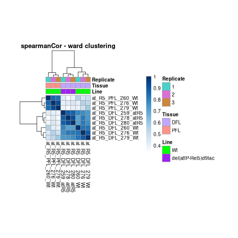

This is confirmed by the Principal Component Analysis:

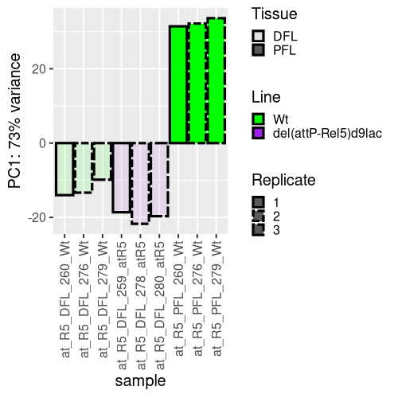

We can also see that the second component cannot discriminate between genotypes. Probably because there are no sample which are PFL and del(attP-Rel5)d9lac (in the initial dataset with these samples the PC2 was able to discriminate).

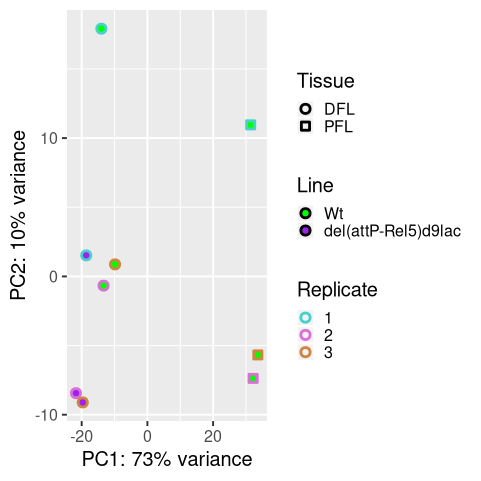

In the configuration file, it is not possible to choose the size of the dots in the PCA plots. If you want to change them, you can use the newly generated file `~/rnaseq_rscripts/example/configFileRNAseq_step3_commandLinesLaunched.R`.
If you change line 45 `size=3` to `size=5` and line 14 `outputFolder <- "~/rnaseq_rscripts/outputs/plots/step3/"` to `outputFolder <- "~/rnaseq_rscripts/outputs/plots/step3_larger/"`.
Then you source it in RStudio or do: `Rscript ~/rnaseq_rscripts/example/configFileRNAseq_step3_commandLinesLaunched.R `.
You would get:

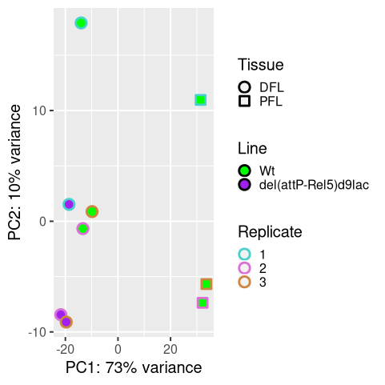


For the genes, you have both individual gene plots:

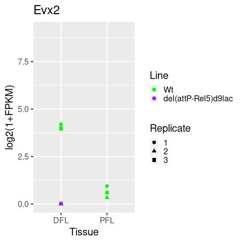
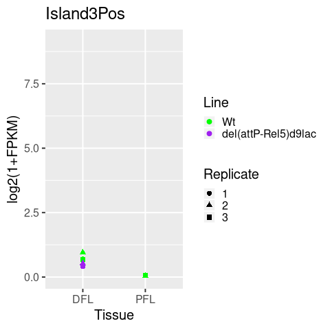
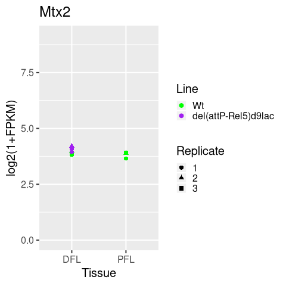

And global heatmap

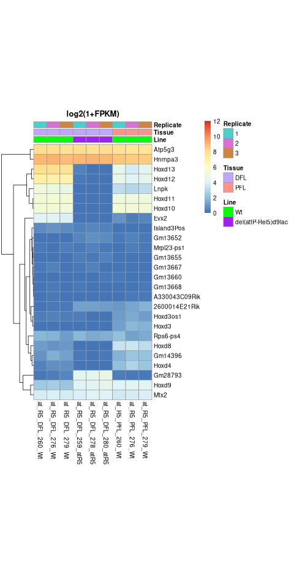

Now we can have a look to the differential analysis results:

## Launch the fourth script

Either you use command line (To be able to click we need to do in R):
```
R
source("~/rnaseq_rscripts/step4-graphVolcanoAndMAP.R")
~/rnaseq_rscripts/example/configFileRNAseq_step4DFL_hoxdAndaround.R
```

Or you open step4-graphVolcanoAndMAP.R in RStudio, click on the source button (top right).
They you can click on the points that interest you.
Then validate by pressing ESC if you are on RStudio and click right if you are in command line.
You need to do it twice, once for volcano, once for MA plot.

You have for each plot (Volcan or MAP), four files.
- One is the original file with no gene displayed.
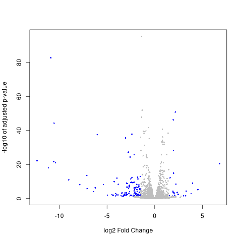
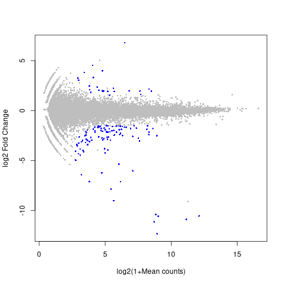
- Another is the one with the clicked genes but labels can overlap.
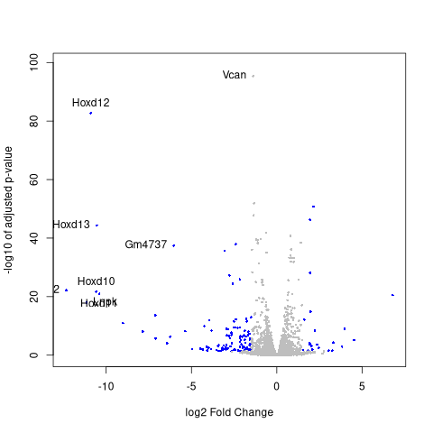
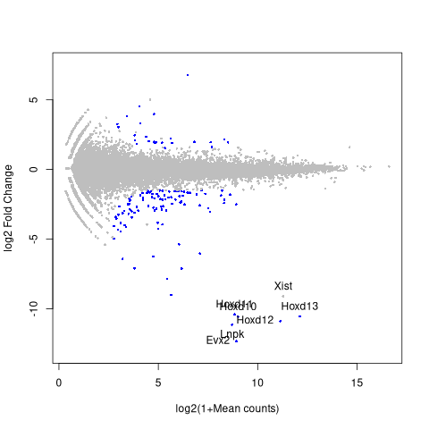
- Another is the same but the overlapping labels are not overlapping anymore.
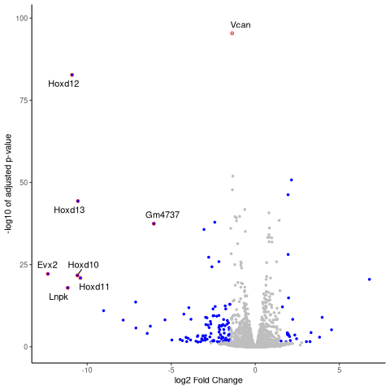
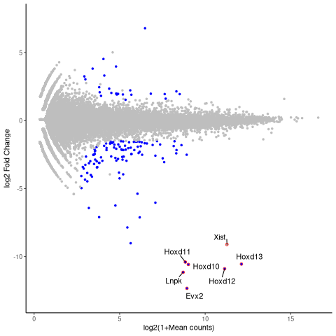
- Finally one with the list of gene provided.
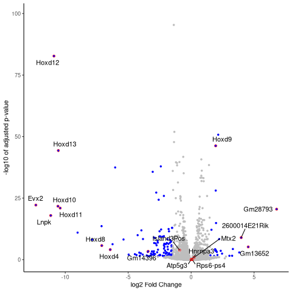
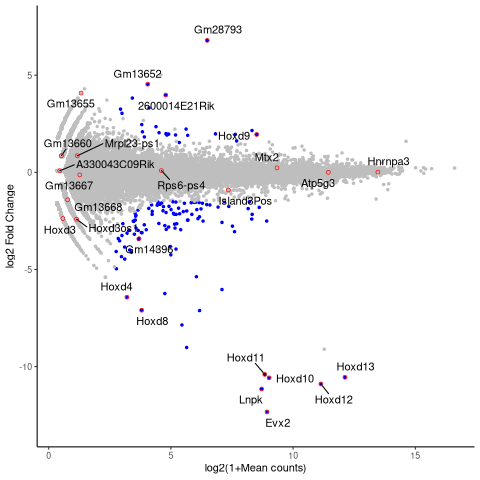

In addition, you will have text files with the values of the genes clicked.
